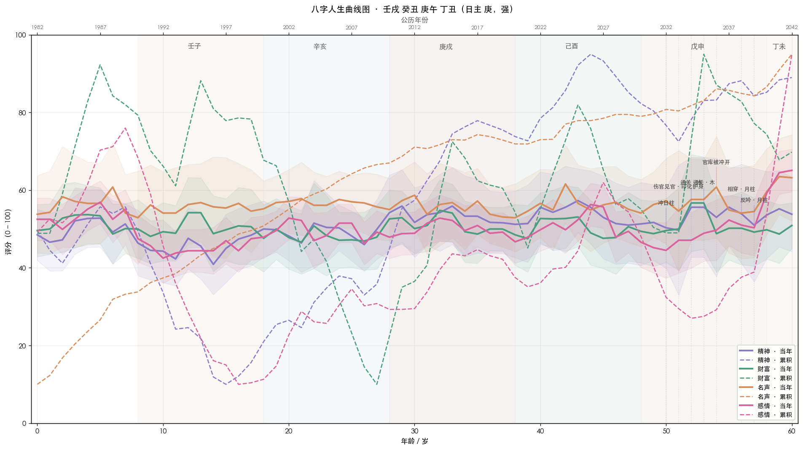

# 示例 2：官印相生格 · 女命

> 本示例八字为构造的典型格局案例，**不指向任何真实个人**。
> 用于演示官印相生 / 体制 / 学术型命造的曲线特征。

## 八字盘

```
                年柱     月柱     日柱     时柱
天干           壬       癸       庚       丁
地支           戌       丑       午       丑
藏干主气       戊       己       丁       己
十神           食神     伤官     日主     正官
              偏印     正印     正官     正印
```

- **日主**：庚金
- **强弱**：强（冬月庚金，月支丑土生金，日支午火虽克金但有丑土通关）
- **用神**：木（财，泄秀引出戊申庚金的能量）
- **喜神**：火（官星，制金）
- **忌神**：土（生金过旺）
- **通关用神**：木（金水冷局需木火暖之）
- **季节**：冬生庚金需调候（火）+ 疏土（木）
- **格局**：**官印相生**（午官 + 丑印 + 时支再印）+ 食伤透出 = 体制内学术 / 文化型结构

## 命盘解读

- **能量结构**：官印相生为主，食伤透出为辅 → 既有体制 / 学术身份，又有产出表达
- **优势**：印星厚（双丑 + 时干气化），平台 / 学历 / 被认可属性强
- **挑战**：食伤泄秀（壬癸食伤透干）需平衡，否则官星受冲会影响名声
- **关键关口**：丑午相害（精神层面易耗）、戌冲辰（财库相关年）
- **总体走势**：早年印星沉淀慢热、青年期官印发力、中年学术 / 体制成名、晚年沉淀

## 大运排布

| 大运 | 干支 | 起始年龄 | 公历年份 |
|---|---|---|---|
| 1 | 壬子 | 8 | 1990 |
| 2 | 辛亥 | 18 | 2000 |
| 3 | 庚戌 | 28 | 2010 |
| 4 | 己酉 | 38 | 2020 |
| 5 | 戊申 | 48 | 2030 |
| 6 | 丁未 | 58 | 2040 |

## v8 相位决策（Phase Decision）

> Schema v8 起，Agent 在 `solve_bazi.py` 阶段就会写入一份**临时（provisional）相位决策**到 `bazi.json` 的
> `phase` / `phase_decision` 字段。本盘属于 detector 没有任何反相触发的"标准官印相生"，先验直接
> 落在 `day_master_dominant`（默认日主主导，置信度 high，prob=0.900）。

```json
"phase": {
  "id": "day_master_dominant",
  "label": "默认 · 日主主导",
  "is_provisional": true,
  "is_inverted": false,
  "default_phase_was": "day_master_dominant",
  "confidence": "high",
  "decision_probability": 0.9
}
```

`handshake.json` 中 `phase_candidates` 共 5 个（`day_master_dominant`, `climate_inversion_dry_top`,
`climate_inversion_wet_top`, `dominating_god_cai_zuo_zhu`, `dominating_god_guan_zuo_zhu`），
其余 4 个候选先验皆 ≤ 0.006，作为对照保留。

Step 2.5 校验流程（v8.1 两轮）：

1. **R1**：Agent 读 `guan_yin_xiang_sheng.handshake.json`，用宿主 AskQuestion 抛全部 22 道题。
2. R1 用户答案到 `user_answers.r1.json` 后，跑 `phase_posterior.py --round 1` 写出 R1 决策。
3. **R2 · 必跑**：跑 `handshake.py --round 2` 在 R1 决策 phase 与 runner-up 之间挑 6-8 道高 pairwise 判别力的题（自动排除 R1 已问过的）→ AskQuestion 抛 → `phase_posterior.py --round 2` 写 `bazi.phase_confirmation`。
4. 看 `bazi.phase_confirmation.action`：`render` 直接出图；`render_with_caveat` 加解读 caveat；`escalate` 报告"决策反转 / 后验不足"，建议核对时辰 / 性别。

本盘 R1 prior 已经 ≈ 0.900，预期 R2 多数情形落在 `confirmed` (`render`)。

```bash
# R1
python3 ../scripts/phase_posterior.py --round 1 \
  --bazi guan_yin_xiang_sheng.bazi.json \
  --questions guan_yin_xiang_sheng.handshake.json \
  --answers user_answers.r1.json \
  --out guan_yin_xiang_sheng.bazi.json

# R2
python3 ../scripts/handshake.py --round 2 \
  --bazi guan_yin_xiang_sheng.bazi.json \
  --curves guan_yin_xiang_sheng.curves.json \
  --r1-handshake guan_yin_xiang_sheng.handshake.json \
  --r1-answers user_answers.r1.json \
  --current-year 2026 \
  --out guan_yin_xiang_sheng.handshake.r2.json

python3 ../scripts/phase_posterior.py --round 2 \
  --bazi guan_yin_xiang_sheng.bazi.json \
  --r1-handshake guan_yin_xiang_sheng.handshake.json --r1-answers user_answers.r1.json \
  --r2-handshake guan_yin_xiang_sheng.handshake.r2.json --r2-answers user_answers.r2.json \
  --out guan_yin_xiang_sheng.bazi.json
```

## 50 年评分曲线



> Claude 环境下用 `examples/guan_yin_xiang_sheng.html` 直接以 Artifact 渲染。

## 命理学解读（图上要点）

- **童年 0–8 岁**：年柱壬戌食神 + 偏印组合，精神平稳起步，名声 / 财富累积线缓慢
- **少年 8–17 岁（壬子运）**：壬子食伤外泄过度，精神累积线低位，但才华显现
- **青年 18–27 岁（辛亥运）**：辛劫财 + 亥食神，体制路径开启
- **盛年 28–37 岁（庚戌运）**：庚比肩 + 戌火库被丑湿土收，**学术 / 体制中段成名期**，名声实线 + 累积线双双抬升
- **中年 38–47 岁（己酉运）**：己正印 + 酉劫财，**官印枢纽强化**，名声累积线达到高位
- **沉淀期 48–57 岁（戊申运）**：戊偏印 + 申比肩，体制内身份巩固，财富回升缓慢但稳定
- **晚景 58+（丁未运）**：丁正官得未印，晚年仍有体制荣誉

## 关键拐点（脚本输出）

未来 10 年（2027–2036）拐点见 `guan_yin_xiang_sheng.curves.json` → `turning_points_future`。

## 派别争议年份（共 22 条 · LLM 解读样例）

```
【1990 年（庚午） · 8 岁 · 大运壬子 · 名声维度】

事实：扶抑派 78.5 / 调候派 54.0 / 格局派 54.0（极差 24.5，融合 64.0）。

为何分歧：
- 扶抑派看好：1990 庚午 + 大运壬子，庚金比肩同党 + 壬水食神泄秀，
            日主庚金身偏弱（冬月），见同党 + 食伤泄秀皆为吉。
- 调候 / 格局派持平：丑月生庚金，调候要丙火暖局；庚午年虽有午火，
                  但被大运壬子直接冲克（子午冲），调候作用大打折扣。
                  格局上「官印相生」未被破也未被加强。

我的判断：偏向调候 / 格局派的中性判读，扶抑派分数过高需折扣。
理由：本命局月柱癸丑、大运壬子，水势已经非常旺；
     再多比肩反而会加剧"水多金沉"的隐患；
     扶抑派在身弱时倾向加分同党，但忽略了"过犹不及"。

合理推论：8 岁是童年早期，名声维度对个体不直接显化，
        但可能反映为「学业起步、被外界关注」的小高光（如学龄期表现被表扬），
        强度比扶抑派打的 78.5 要弱很多。
        置信度 low（争议年 + 童年 + 维度对儿童不直接对应）。

可证伪点：如果当事人 1990 年并无任何被外界关注 / 被表扬的记忆，
        则说明融合后的 64 分仍偏高，扶抑派权重在童年期需进一步降低。
```

> 完整 22 条争议年份解读见 `guan_yin_xiang_sheng.html`（Artifact 渲染）。

## 男 / 女命对比

同一八字若性别翻转：

- **基线（baseline）**：完全一致（公正性要求，详见 `references/fairness_protocol.md` § 5）
- **唯一差异**：大运起运方向（阴男阳女顺、阳男阴女逆）→ 大运时间表不同 → 流年评分时间序列不同

可用 `python3 ../scripts/calibrate.py --symmetry` 验证。

## 重新生成

```bash
cd ~/.claude/skills/bazi-life-curves/examples
python3 ../scripts/solve_bazi.py --pillars "壬戌 癸丑 庚午 丁丑" --gender F --birth-year 1982 --out guan_yin_xiang_sheng.bazi.json
python3 ../scripts/score_curves.py --bazi guan_yin_xiang_sheng.bazi.json --out guan_yin_xiang_sheng.curves.json --strict --age-end 60 --dispute-threshold 18
python3 ../scripts/handshake.py --bazi guan_yin_xiang_sheng.bazi.json --curves guan_yin_xiang_sheng.curves.json --current-year 2026 --out guan_yin_xiang_sheng.handshake.json
# (Step 2.5：Agent 用 AskQuestion 抛 ≥3 道判别题；用户回答后写入 confirmed_facts.json
#  并通过 phase_posterior.py 决定是否更新 bazi.phase；标准 day_master_dominant 盘多数情形可直接通过)
python3 ../scripts/render_artifact.py --curves guan_yin_xiang_sheng.curves.json --out guan_yin_xiang_sheng.html
python3 ../scripts/render_chart.py --curves guan_yin_xiang_sheng.curves.json --out guan_yin_xiang_sheng.png
```
