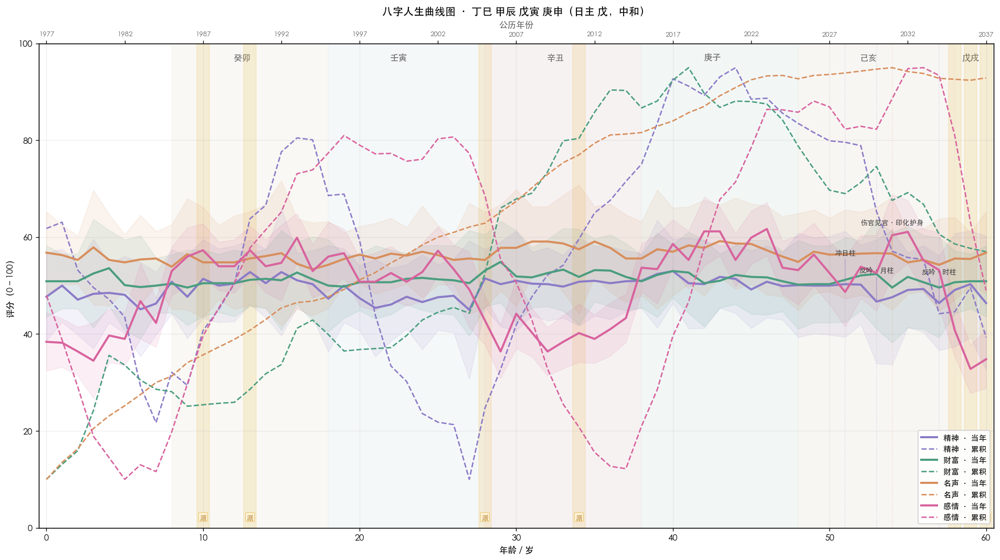

# 示例 1：伤官生财格 · 男命

> 本示例八字为构造的典型格局案例，**不指向任何真实个人**。
> 用于演示 skill 的输入 → 命盘分析 → 评分 → 出图全流程。

## 八字盘

```
                年柱     月柱     日柱     时柱
              (祖辈)   (父母 / 自我宫)   (本我)   (子女 / 晚景)
天干           丁       甲       戊       庚
地支           巳       辰       寅       申
藏干主气       丙       戊       甲       庚
十神           正印     七杀     日主     食神
              (年支)  (月支)  (日支)  (时支)
              偏印     比肩     七杀     食神
```

- **日主**：戊土
- **强弱**：中和（春土得月令戊辰本气支撑，但寅木七杀克身、巳火印星生身，整体平衡）
- **用神**：金（食神泄秀生财，引出戊土中和后的"产出力"）
- **喜神**：水（财星，承接金的产出）
- **忌神**：土（比劫夺财）
- **季节**：春生戊土，喜疏土（木已得令）
- **格局**：庚申食神当令时柱 + 寅木七杀月支 = **食神制杀 / 食神生财** 复合格

## 命盘解读

- **能量结构**：身杀两停 + 食神生财时柱出干，是典型「**用产出换权力 / 换钱**」的结构
- **优势**：食神坐时柱（庚申），晚年作品 / IP / 资产持续兑现
- **关键关口**：辰戌冲（库地未冲开但有暗藏）、寅申冲（月时冲，中年事业模式切换）
- **总体走势**：早年靠印星沉淀、青年期食神发动、中年财库逐步形成、晚年沉淀名声

## 大运排布

| 大运 | 干支 | 起始年龄 | 公历年份 |
|---|---|---|---|
| 1 | 癸卯 | 8 | 1985 |
| 2 | 壬寅 | 18 | 1995 |
| 3 | 辛丑 | 28 | 2005 |
| 4 | 庚子 | 38 | 2015 |
| 5 | 己亥 | 48 | 2025 |
| 6 | 戊戌 | 58 | 2035 |

## v8 相位决策与判别问答（Step 2.5）

> v8 起，"出图前下马威"被重构为**多维相位判别问答**。Agent 不再用自然语言抛 3 条假设让用户口头确认；
> 而是按 `references/handshake_protocol.md` 通过结构化 `AskQuestion` 工具抛出可点选题目，用户答案
> 通过 `phase_posterior.py` 做 Bayesian 更新，再决定是否覆写 `bazi.phase`。

**provisional decision（先验直出，未与用户校验前）：**

```json
"provisional_decision": {
  "decision": "day_master_dominant",
  "confidence": "high",
  "decision_probability": 0.900,
  "is_provisional": true
}
```

候选 5 个相位中（`day_master_dominant`、`climate_inversion_dry_top`、`climate_inversion_wet_top`、
`dominating_god_cai_zuo_zhu`、`dominating_god_guan_zuo_zhu`），仅 `day_master_dominant` 先验显著
（≈ 0.900），其余 ≤ 0.006，可视为弱对照。

**Step 2.5 判别问答（22 题 · 5 个维度）**

`handshake.json/questions[]` 排序后摘前 6 条（按 `discrimination_power` 降序）：

| # | 题目 ID | 维度 | 判别力 |
|---|---|---|---|
| 1 | `D1_Q4_siblings` | ethnography_family（兄弟姐妹结构） | 0.551 |
| 2 | `D1_Q3_mother_presence` | ethnography_family（母亲在场度） | 0.353 |
| 3 | `D1_Q2_father_presence` | ethnography_family（父亲在场度） | 0.318 |
| 4 | `D1_Q1_birth_economic_condition` | ethnography_family（出生经济条件） | 0.269 |
| 5 | `D1_Q5_birth_place_era` | ethnography_family（出生地 × 时代） | 0.203 |
| 6 | `D2_Q6_attraction_age_pattern` | relationship（择偶年龄偏好） | 0.586 |

题目分布覆盖 5 个维度：D1 民族志 / 原生家庭 · D2 关系 · D3 流年大事件（动态生成 · 本盘 4 条） ·
D4 中医 · D5 自我感知。Agent **必须**通过 `AskQuestion` 抛出至少前 3 条；只有当 posterior 明显
偏离 prior（决策跳出 `day_master_dominant`、置信度 ≥ "high"）时，才会触发 `phase_posterior.py`
覆写 `bazi.phase` 并重渲染。

**v8.1 · Round 2 confirmation（必跑）**

> R1 即使 high confidence，也存在"答对几道家庭题就被偶然推到从财"的风险。R2 拿 R1 决策
> phase 与 runner-up 之间高 pairwise 判别力的 6-8 道题再问一次，看决策是否经得起第二批独立证据。

```bash
# R1 用户答案到位后（user_answers.r1.json）
python3 ../scripts/phase_posterior.py --round 1 \
  --bazi shang_guan_sheng_cai.bazi.json \
  --questions shang_guan_sheng_cai.handshake.json \
  --answers user_answers.r1.json \
  --out shang_guan_sheng_cai.bazi.json

# 跑 R2 confirmation handshake
python3 ../scripts/handshake.py --round 2 \
  --bazi shang_guan_sheng_cai.bazi.json \
  --curves shang_guan_sheng_cai.curves.json \
  --r1-handshake shang_guan_sheng_cai.handshake.json \
  --r1-answers user_answers.r1.json \
  --current-year 2026 \
  --out shang_guan_sheng_cai.handshake.r2.json

# Agent 抛 R2 题 → user_answers.r2.json → 合并算最终后验
python3 ../scripts/phase_posterior.py --round 2 \
  --bazi shang_guan_sheng_cai.bazi.json \
  --r1-handshake shang_guan_sheng_cai.handshake.json --r1-answers user_answers.r1.json \
  --r2-handshake shang_guan_sheng_cai.handshake.r2.json --r2-answers user_answers.r2.json \
  --out shang_guan_sheng_cai.bazi.json
```

R2 输出 `bazi.phase_confirmation.action` ∈ {`render`, `render_with_caveat`, `escalate`}：

| confirmation_status | 出图 | 解读 caveat |
|---|---|---|
| `confirmed`（R2 决策 == R1 AND prob ≥ 0.85） | ✓ 直接出图 | 无 |
| `weakly_confirmed`（决策一致 AND 0.65 ≤ prob < 0.85） | ✓ 出图 | 自动加"R2 弱确认"caveat |
| `uncertain`（决策一致 AND prob < 0.65） | ✗ escalate | 建议核对时辰 / 性别 |
| `decision_changed`（R2 决策 != R1） | ✗ escalate | 必须报告反转 |

> 完整握手数据见 `shang_guan_sheng_cai.handshake.json` / `.handshake.r2.json`；判别问答原始定义见
> `references/discriminative_question_bank.md`；两轮校验完整协议见 `references/handshake_protocol.md` §4。

## 50 年评分曲线



> Claude 环境下用 `examples/shang_guan_sheng_cai.html` 直接以 Artifact 渲染，可交互（hover 看每年数值，缩放）。

## 命理学解读（图上要点）

- **童年 0–8 岁（起运前）**：年柱丁巳印星护身，精神实线波动但累积线起步阶段值小，财富 / 名声尚未启动
- **少年 8–17 岁（癸卯运）**：癸正财、卯正官，但卯木为忌（土被克），财富累积线起步缓慢，精神有压力
- **青年 18–27 岁（壬寅运）**：壬偏财得令、寅七杀坐月支重伏吟，财源开启但伴随压力，名声开始抬头
- **创业期 28–37 岁（辛丑运）**：辛伤官 + 丑财库（湿土收金），**伤官生财链路成立**，财富累积线明显抬升，但精神实线波动加大
- **盛年 38–47 岁（庚子运）**：庚食神得令 + 子水正财，**食神生财全开**，所有维度峰值，财富累积线快速攀升
- **沉淀期 48–57 岁（己亥运）**：己劫财夺财（中和身见劫财），财富实线回落，但名声累积线继续走高（沉淀效应）
- **晚景 58+（戊戌运）**：戊戌伏吟年柱（注：年柱丁巳，戊戌不是伏吟；实际可能戊辰才伏吟月柱），整体进入收束期

## 关键拐点（脚本输出）

未来 10 年（2027–2036）拐点见 `shang_guan_sheng_cai.curves.json` → `turning_points_future`。

## 派别争议年份（共 14 条 · LLM 解读样例）

脚本只能告诉你"三派打分极差超过阈值"，**具体推论必须由 LLM 结合命局判断**。下面演示对其中 1 条的解读（其余条目照同样格式继续）：

```
【1982 年（壬戌） · 5 岁 · 大运起运前 · 财富维度】

事实：扶抑派 38.6 / 调候派 49.2 / 格局派 61.8（极差 23.2，融合 51.0）。

为何分歧：
- 格局派看好：壬戌年戌冲辰（月支辰库），库被冲开 → 财库启动信号。
- 扶抑派反对：戌为燥土，加重戊土比劫力量 → 中和戊土遇比劫即夺财。

我的判断：偏向扶抑派。
理由：本命局戊土已得月令、印星生身（丁巳），并不需要再扶；
     冲开的辰库藏戊乙癸，开出来的主气是戊土比劫，不是癸水正财；
     格局派的"库开则发"在此例并不成立，因为开出的是忌神。

合理推论：5 岁是童年（起运前），财富维度对个人本身不直接体现，
        但可能反映为「家庭财富的不稳定」（父母层面的财务波动）。
        置信度 low（争议年 + 童年期）。

可证伪点：如果当事人记忆中 1982 年家庭财务并无波动（既无好转也无恶化），
        则说明扶抑派的解读在童年期权重需进一步降低。
```

> 完整 14 条争议年份逐条解读见 `shang_guan_sheng_cai.html`（Artifact 渲染时带卡片 + LLM 推论位置）。
> LLM 解读规则见 `references/dispute_analysis_protocol.md`。

## 重新生成

```bash
cd ~/.claude/skills/bazi-life-curves/examples
python3 ../scripts/solve_bazi.py --pillars "丁巳 甲辰 戊寅 庚申" --gender M --birth-year 1977 --out shang_guan_sheng_cai.bazi.json
python3 ../scripts/score_curves.py --bazi shang_guan_sheng_cai.bazi.json --out shang_guan_sheng_cai.curves.json --strict --age-end 60 --dispute-threshold 18
python3 ../scripts/handshake.py --bazi shang_guan_sheng_cai.bazi.json --curves shang_guan_sheng_cai.curves.json --current-year 2026 --out shang_guan_sheng_cai.handshake.json
# Round 1（disambiguation）：Agent 用 AskQuestion 抛全部题给用户点选，写 user_answers.r1.json，然后
# python3 ../scripts/phase_posterior.py --round 1 --bazi shang_guan_sheng_cai.bazi.json \
#   --questions shang_guan_sheng_cai.handshake.json --answers user_answers.r1.json \
#   --out shang_guan_sheng_cai.bazi.json
# Round 2（confirmation · 必跑）：
# python3 ../scripts/handshake.py --round 2 --bazi shang_guan_sheng_cai.bazi.json \
#   --curves shang_guan_sheng_cai.curves.json \
#   --r1-handshake shang_guan_sheng_cai.handshake.json --r1-answers user_answers.r1.json \
#   --current-year 2026 --out shang_guan_sheng_cai.handshake.r2.json
# Agent 抛 R2 题 → user_answers.r2.json，然后
# python3 ../scripts/phase_posterior.py --round 2 --bazi shang_guan_sheng_cai.bazi.json \
#   --r1-handshake shang_guan_sheng_cai.handshake.json --r1-answers user_answers.r1.json \
#   --r2-handshake shang_guan_sheng_cai.handshake.r2.json --r2-answers user_answers.r2.json \
#   --out shang_guan_sheng_cai.bazi.json
# bazi.phase_confirmation.action == "render" / "render_with_caveat" 才进入下面渲染；
# == "escalate" 时停下来提示核对时辰 / 性别。
python3 ../scripts/render_artifact.py --curves shang_guan_sheng_cai.curves.json --out shang_guan_sheng_cai.html
python3 ../scripts/render_chart.py --curves shang_guan_sheng_cai.curves.json --out shang_guan_sheng_cai.png
```
