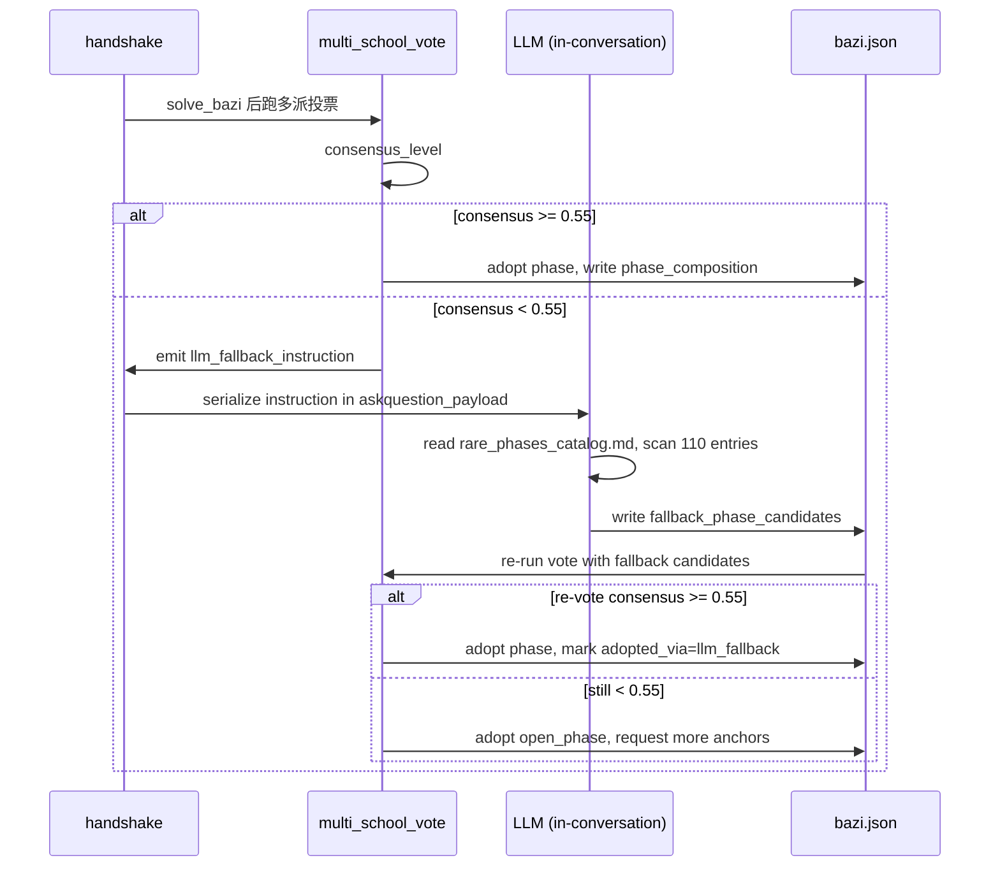

# LLM Fallback Protocol（特殊格 inline 兜底协议 · v9 PR-5）

> 用户选择：A 方案 — **协议化 inline prompt**（零工程依赖、零网络、零 API key）。
> 当 detector + multi_school_vote 共识不足，handshake 输出"强制 LLM 自检指令"，
> 由当前对话里的 LLM（即 Claude / GPT / Gemini 自己）按 [rare_phases_catalog.md](rare_phases_catalog.md)
> 全表逐条比对触发条件，结果写回 `bazi.json.fallback_phase_candidates`。

---

## §1 触发条件

满足以下任一即触发：

- 改动六 multi_school_vote 共识 < 0.55
- top-1 与 top-2 后验差 < 0.10
- 算法识别出"古书原话里出现但 detector 没覆盖的字符模式"（如纯阳/纯阴/天罡/地魁等）
- 用户提供的事件锚点全部被算法 phase 反例（HS-R7 自检红灯）

触发位点：[scripts/handshake.py](../scripts/handshake.py) 在 R1/R2 输出最后追加 `llm_fallback_instruction`。

---

## §2 协议化指令格式

```json
{
  "llm_fallback_instruction": {
    "version": "v9-PR5",
    "trigger_reason": "consensus < 0.55 AND top1_top2_gap < 0.10",
    "task": "rare_phase_exhaustive_scan",
    "input_pillars": "丙子 庚子 己卯 己巳",
    "input_root_strength": {"label": "弱根", "yin_root": 1.0, "bijie_root": 0.2},
    "input_climate": {"label": "燥实", "干头分": 5.0, "地支分": -2.0},
    "input_anchor_events": [
      {"year": 2015, "type": "学业", "polarity": "+大事件"},
      {"year": 2026, "type": "事业迁徙", "polarity": "+大事件"}
    ],
    "instruction": "你必须严格按以下步骤操作:",
    "steps": [
      "1. 打开 references/rare_phases_catalog.md",
      "2. 逐条扫描 ALL ~110 条特殊格 (Tier 1 + Tier 2 + Tier 3)",
      "3. 对每条 rare phase, 判断当前盘是否触发其'触发条件'列",
      "4. 仅记录触发的, 给出 match_confidence (0-1) + 古书原文引用 + 为什么算法没识别",
      "5. 输出 fallback_phase_candidates JSON 数组, 写回 bazi.json"
    ],
    "output_schema": {
      "fallback_phase_candidates": [
        {
          "id": "(catalog 中的 id)",
          "school": "(catalog 中的 流派)",
          "match_confidence": 0.6,
          "古书引用": "如《滴天髓·化气论》'…'",
          "为什么算法没识别": "如 root_strength 在边界 (0.7) 上, detector 设的是 < 0.5 → 漏",
          "建议 ratify_action": "include_in_vote / advisory_only / reject"
        }
      ]
    },
    "discipline": [
      "宁可少报 (precision > recall)",
      "match_confidence < 0.4 一律不输出",
      "无法找到古书出处的直觉判断, 标 source='algorithm_inference'",
      "不能编造古书引文, 不确定就空着该字段"
    ]
  }
}
```

---

## §3 LLM 处理纪律（HS-R7 衍生）

LLM 在响应这个指令时**必须**：

1. **真的去读 catalog**：如果 catalog 文件不可读，必须报告 "catalog_unreadable"，不能凭记忆输出。
2. **真的逐条比对**：不能只看 catalog 的标题，必须看每条的"触发条件"列。
3. **不能编造古书原文**：宁可空 `古书引用` 字段，不能写"《滴天髓》某章"这种含糊话。
4. **保持 precision-first**：宁可输出 0 条，不输出错误候选。
5. **声明不确定性**：每条都要给 confidence + 推理链条。

---

## §4 兜底结果回流

`fallback_phase_candidates` 由 [scripts/multi_school_vote.py](../scripts/multi_school_vote.py)（PR-6）按各自 school weight 计票：

- Tier 1 (五行派) `weight=1.0`
- Tier 2 (盲派) `weight=0.8`
- Tier 3 (数理派) `weight=0.3` 仅 ratify

回流后投票：

- 若兜底救出一个 medium-high 共识候选 → 升级 phase，记录 `phase.adopted_via=llm_fallback`
- 若仍无共识 → 触发 5.6 `open_phase` 逃逸阀，提示用户补 anchor 事件

---

## §5 与改动六的协作



---

## §6 安全声明

- 此协议**不**调用任何外部 API（OpenAI / Anthropic / 本地 Ollama 全部不需要）
- 所有 LLM 推理在当前 IDE 对话上下文内完成
- 用户可通过 `BAZI_DISABLE_LLM_FALLBACK=1` 关闭整套兜底，仅用算法 detector
- 兜底结果都标 `source=llm_inference`，不能与 detector 输出混淆
